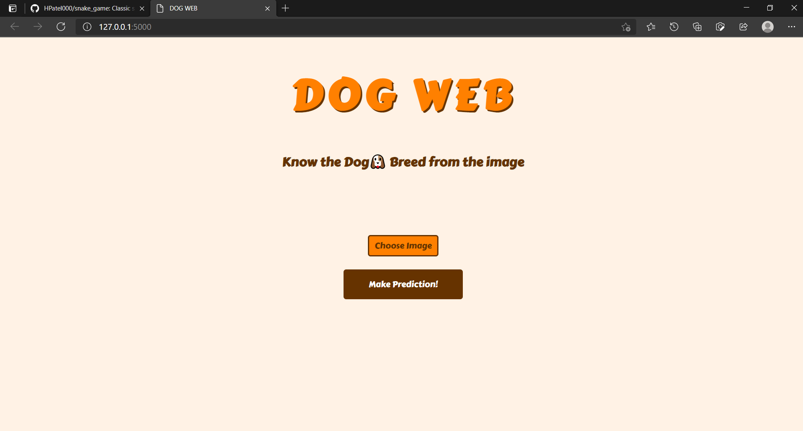
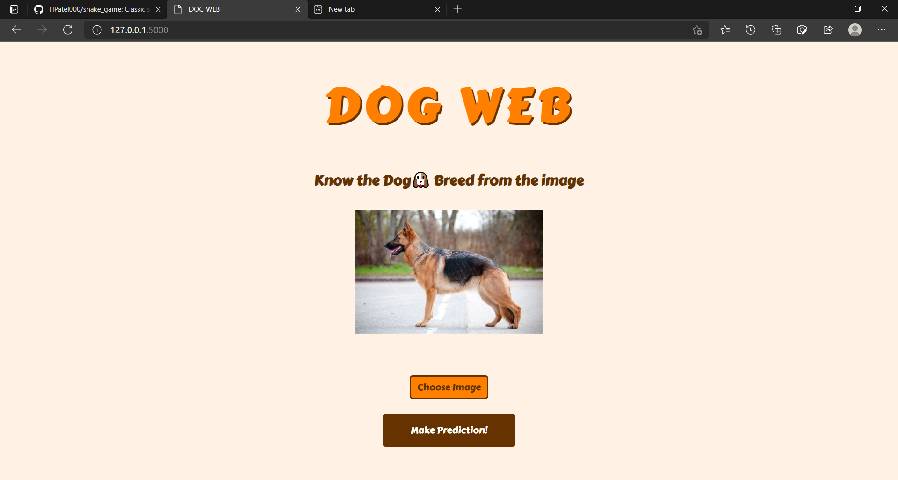
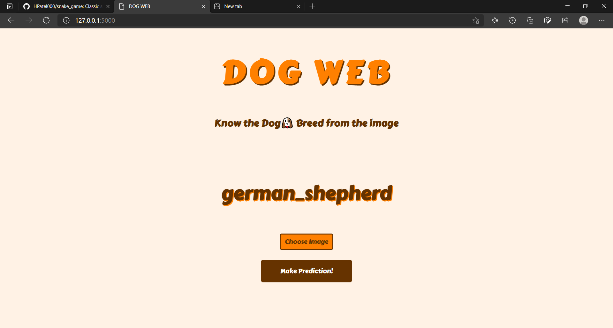

# Dog-Web
## Makes prediction about dog breed from the image using keras model
* Used Flask as backend and jinja as view engine
* image classification model uri = <a href='https://tfhub.dev/google/imagenet/mobilenet_v2_130_224/classification/4'>https://tfhub.dev/google/imagenet/mobilenet_v2_130_224/classification/4</a>

